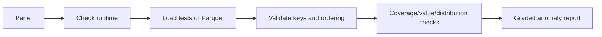

# Factor Drift Monitor Skill

[中文](README.md) | English

Diagnose missingness, duplicates, outliers, coverage changes, and distribution drift in `(date, symbol)` panels. This is a diagnostic tool: it does not create factors, run backtests, or rewrite source data.

Original contributor: cuijie0317. QUANTSKILLS publication maintainer: abgyjaguo. This community project does not claim official certification or endorsement.

## Flow

```text
explicit input, synthetic sample, or .env Parquet -> contract check -> sort symbol ASC/date DESC
-> coverage and value checks -> window statistics/PSI/KS -> graded report
```

Use an explicitly provided input first. For a local demo, run `tests/generate_synthetic_panel.py` to create a deterministic sample containing no real market data. Otherwise read `PARQUET_ROOT_PATH` from `.env`. Request only the selected fields and dates.

## Input and ordering

At minimum provide `date`, `symbol`, and numeric fields to inspect. Typical fields are `close`, `high`, `low`, `open`, `volume`, and `amount`; custom factors are supported. CSV and Parquet are supported. Keep real paths, data, and reports out of Git.

After loading, sort by `symbol` ascending and `date` descending. The script creates a separate ascending-time copy for derived returns so inspection order cannot reverse time.

## Checks

- Structure: empty input, missing columns, types, duplicate `(date, symbol)` keys.
- Coverage: symbol/sample counts, date ranges, and missing rates.
- Values: non-finite values, non-positive prices, OHLC relationships, and distribution anomalies.
- Drift: baseline versus recent mean, standard deviation, ratio, PSI, and KS.

PSI/KS can be unstable for tiny universes. Mark low confidence and do not declare a factor invalid from those statistics alone.

## Usage and output

```powershell
python tests/generate_synthetic_panel.py
python scripts/monitor_factor_drift.py --input tests/synthetic_panel.csv --output tests/synthetic_report
```

`normal` means no material anomaly; `watch` means minor change or insufficient sample; `warning` requires review; `failed` means the contract cannot be met. Reports must include source, fields, dates, sample size, metrics, reasons, impact, and remediation. A warning is not a deletion instruction; first check source data, adjustment policy, and corporate actions.

See `SKILL.md`, `references/data-contract.md`, `references/output-contract.md`, and `references/prompt_template.md`.

## Production Pipeline



## Problem Solved

Find missing data, duplicates, outliers, coverage changes, and factor distribution drift before they are mistaken for a factor or strategy problem.

## Input Data Requirements

Provide `date`, `symbol`, and at least one numeric field. CSV and Parquet are supported. `close` or an explicit return column is optional for predictive drift diagnostics. Sort by `symbol` ascending and `date` descending after loading.

## Generated Check Structure

```text
source -> normalized panel -> coverage/value checks
       -> baseline vs monitoring window -> status/reasons
```

## Quick Start

```powershell
python tests/generate_synthetic_panel.py
python scripts/monitor_factor_drift.py --input tests/synthetic_panel.csv --factors close,volume --output tests/synthetic_report
```

## Validation Metrics

Missing rate, duplicate keys, date coverage, sample count, mean shift in standard-deviation units, standard-deviation ratio, PSI, and KS. With a return column, include Rank IC and IC retention. Mark tiny-sample conclusions as low confidence.

## Install in an Agent Environment

Copy this directory into the Agent skills directory. In Python 3.12 install `pandas`, `numpy`, and the required Parquet reader, then copy `.env.example` to `.env` if path discovery is used.

## Repository Contents

`SKILL.md`, bilingual READMEs, `references/` data/output contracts, `scripts/monitor_factor_drift.py`, the `tests/` synthetic-data generator, and multi-runtime loaders under `agents/`.

## License

GPL-3.0-only. Monitoring output is for research and data governance, not investment advice. No real market or private dataset is redistributed in this repository.

## PandaAI / QUANTSKILLS Community

PandaAI / QUANTSKILLS community: <https://github.com/quantskills>.
